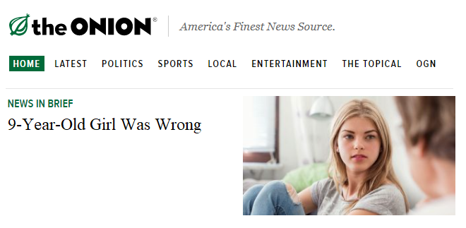

# Hidden Mark.. M..

### Submission by Benjamin Wyss

Generating Fake Text and Predicting Text Using a Hidden Markov Model Trained on 9,000 Article Titles from [The Onion](https://www.theonion.com/)

## Dataset Examined

The Onion or Not: A dataset containing 9,000 article titles taken from [The Onion](https://www.theonion.com/) and 15,062 real article titles taken from the [/r/NotTheOnion Subreddit](https://reddit.com/r/NotTheOnion)

Downloaded from https://github.com/lukefeilberg/onion on 3/15/21

## Ideas

For this project, I realized that modeling the current word of a line of text as an internal state--triggering state transitions whenever a new word is read in--allows for the quantities of state transitions within a text corpus to be observed, and this can be transformed into the state transition matrix of a hidden markov model. Under this construction, the emission matrix of the hidden markov model is designed to always output the word associated with the current state that the model is in.

While the core design of this hidden markov model is simple, there are a couple of additional considerations that must be made. First, symbols such as punctuation marks, capital letters, and other special characters lead to the creation of additional states that should not exist, since strings such as 'cat', 'cat.', and 'Cat', are all syntactically unique even if they are semantically identical. This issue can be solved with sufficient data cleaning. Another consideration is determining the starting and ending states of the model. This can be handled elagantly by inserting unique keywords at the beginning and end of each line of text during data cleaning. These special keywords form unique states that do not cause emissions and are only used to aid in starting and stopping the model. 

## Process

Data cleaning is implemented in [cleanData.py](https://github.com/benjaminwyss/EECS738Project2HMM/blob/main/cleanData.py). This file reads in The Onion or Not Dataset, filters out article titles not from [The Onion](https://www.theonion.com/), strips the article titles of special characters, converts all letters to lowercase, and inserts the special '\<start\>' and '\<end\>' keywords at the beginning and end of each article title.
  
A Hidden Markov Model is implemented in [hmm.py](https://github.com/benjaminwyss/EECS738Project2HMM/blob/main/hmm.py) which contains methods to fit a hidden markov model to a provided text corpus, generate fake text from the fit model, and predict the remaining text in a given prompt using the fit model. Fitting the model consists of generating the state transition matrix by normalizing the quantities of transitions from any given word to another word. Internal dictionaries are used to keep track of a one-to-one mapping from word strings to integer states. Text generation is accomplished by combining the words associated with a random forward walk from the starting state to the ending state using the probality distributions within the fitted state transition matrix. Text prediction works by determining the current state from a given text prompt and then calculating the most likely series of state transitions to occur, termininating when either the end state is the most likely or if a cycle of most likely states is reached.

[main.py](https://github.com/benjaminwyss/EECS738Project2HMM/blob/main/main.py) contains the main driver code and is responsible for reading in the cleaned text corpus, constructing the model, and either generating or predicting text based on a user-specified flag. To run the program execute the main file in the following format:

`py main.py <flag (use -g to generate text or -p to predict text)>`

## Results

Generating fake text from Onion Articles appears to be able to create fake article titles that are humerous, grammatical, and sound like [The Onion](https://www.theonion.com/). Some selected samples with clarifying punctuation added are listed below:

'9-Year-Old Girl was Wrong'

'Sexist Behaviour Most Popular with Walnuts'

'*Video*: Beautiful Interracial Arrests'

'Man Remembers Press Conference From Mandatory Field Injury'

'*Report*: Average Americans Confused by Screaming'

Despite the existence of these ideal results, most fake article titles generated by the model are agrammatical. This occurs because the trained hidden markov model learns nothing about the grammatical structure of article titles, it simply predicts a series of known word-to-word transitions without understanding the (often necessary) context of those transitions. 

Text prediction appears to have perfectly learned many commonly occuring word-to-word transitions, such as following 'donald' with 'trump', 'joe' with 'biden', and 'new' with 'york times'. Despite this, text prediction also suffers from a couple of issues. First, most nouns appear to have the ending state as their most likely state transition, resulting in most predictions ending abruptly after a noun is entered or predicted. Another issue is that text prediction always results in one of two known phrases whenever a common grammatical word is reached. This is because the model has determined the phrases 'the onion americas finest news source' and 'to be a new york times' to be the most likely text whenever words like 'the', 'to', 'be', and 'a' are reached. These issues inherently exist because the most likely series of state transitions is likely to overuse common phrases.

## Conclusions

Overall I am satisfied with the results of the model because it was certainly able to create cases of good output. While it is clear that hidden markov models are not state of the art for text generation and prediction, I am happy with the observed results and interested in investigating optimizations and modern approaches in the future.
